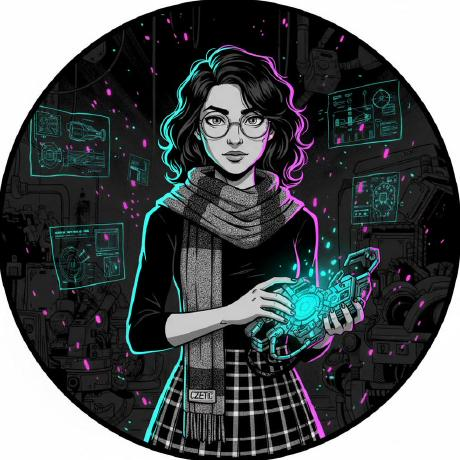

# Simra Faisal — Portfolio



An interactive, dark-themed personal portfolio for [simrafaisal.me](https://simrafaisal.me) — built by hand with plain HTML/CSS/JS plus a tiny Express server for the AI chat.

## Highlights

- **3D particle portrait** — your photo becomes a glowing holographic point-cloud (Three.js / WebGL): flowing scan rows, brightness-mapped depth, and mouse interaction (the portrait tilts toward the cursor and particles gently part around it — the repel only engages when you're actually hovering it).
- **Page-overlay game mode** — click the floating **game mode** button (or press `G`) and a rocket appears over the live page. Steer with arrow keys / WASD (or drag on touch), collect glowing neurons, level up every 12 cells, and chase your best score (saved in `localStorage`). `Esc` exits.
- **Aurora-lit design** — animated gradient orbs drifting behind the navy palette, a shimmering gradient name, and a mouse-tracking spotlight on cards. Accent color is driven by one CSS variable (`--green-bright`) — change it to re-theme the whole site.
- **AI assistant** — a terminal-style chat ("simra-ai") powered by Gemini that answers questions about the site's owner from a hand-written knowledge base.
- **Real content** — At-a-Glance stats, a milestones timeline, certifications, current-focus bullets, and projects that match the live GitHub repos.

## Tech stack

| Area | What's used |
| --- | --- |
| Frontend | Hand-written HTML, CSS, vanilla JS — no framework |
| 3D portrait | Three.js (CDN) + a custom `ShaderMaterial`, `BufferGeometry` / `THREE.Points` |
| Game mode | Pure canvas 2D — zero libraries |
| Chat backend | Node.js + Express + `@google/genai` (Gemini) |
| Deploy | Vercel (git push to `main` auto-deploys) |

## Run locally

Requires Node.js (18+).

```bash
npm install          # express, cors, dotenv, @google/genai
npm start            # or: node server.js
```

Then open **http://localhost:5050**.

The site works without any setup. To enable the AI chat, create `.env` in this folder:

```
GEMINI_API_KEY=your_key_here
```

(Get a free key at https://aistudio.google.com/apikey.)

## Project structure

```
index.html      # single-page markup (hero, about, milestones, projects, …)
style.css       # design system + all sections
script.js       # nav, scrollspy, fade-ins, chat UI, card spotlight
particles.js    # 3D particle portrait (Three.js)
game.js         # page-overlay game mode
photo.png       # source image for the particle portrait
server.js       # Express static server + /api/chat (Gemini)
```

## Customizing

- **Portrait photo** — replace `photo.png` with any square headshot. Nothing else to change.
- **Accent color** — edit `--green-bright` / `--green-tint` in `style.css` (`:root`).
- **Chat knowledge** — edit the `systemInstruction` string in `server.js`.
- **Game** — tune spawn counts, speeds, and level-ups at the top of `game.js`.

## Deploy

Push to `main` — Vercel picks it up automatically. `vercel.json` is a minimal `{ "version": 2 }` (static hosting + the Express API route).
